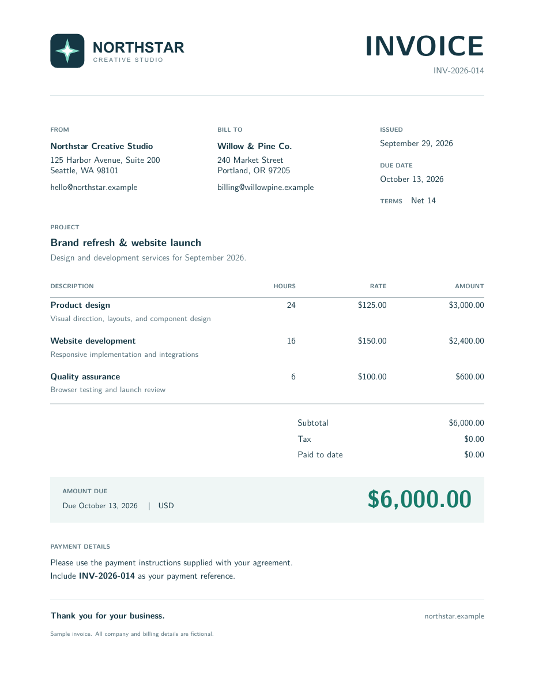

# LaTeX Mobile

Offline LaTeX-to-PDF library with Android/Kotlin and iOS/Swift sample apps. The production build uses **XeTeX + Krilla**, with vendored patches for deterministic mobile output.

**Prerelease status:** `0.1.0-alpha.2` has passed Sonatype validation; publication is being finalized. Android/iOS PDF hash checks pass; see [release review](RELEASE_REVIEW.md) for evidence and coverage limits. [Library sizes](SIZES.md) measure the current XeTeX + Krilla artifacts, including notices.

The current source uses ICU normalization and built-in TeX punctuation instead of TECkit. Custom `.tec` font mappings are unsupported. Host comparisons and the full-profile ARM64 Android/iOS invoice hash comparison pass.

Project-authored code is MIT-licensed; bundled components have their own licenses. Only compile trusted LaTeX; shell escape and HTTP are disabled, but this is not a filesystem or CPU sandbox.

## Invoice example

[](output/pdf/northstar-invoice.pdf)

[View the generated PDF](output/pdf/northstar-invoice.pdf) · [Download PDF](output/pdf/northstar-invoice.pdf?raw=true) · [LaTeX source](examples/invoice.tex)

Use **balanced** or **full**. The example embeds a vector PDF logo; a PNG logo is also included. Convert SVG logos to PDF before embedding.

### Android

Copy `examples/invoice.tex` and `examples/invoice.assets/logo.pdf` into your app's `src/main/assets/`, preserving the `invoice.assets` folder. The [Android sample app](android/harness) already packages these files.

```kotlin
import java.io.File
import org.latexmobile.LatexMobile

// Run on a worker thread. The logo streams from app assets into temporary storage.
val source = context.assets.open("invoice.tex").bufferedReader().use { it.readText() }
val invoice = LatexMobile.compileWithAssets(
    context,
    source,
    File(context.filesDir, "invoice.pdf"),
    mapOf("logo.pdf" to LatexMobile.Asset.AppAsset("invoice.assets/logo.pdf"))
)
// invoice.pdf is the generated file.
```

After the build setup below, install the sample and choose **Invoice · PDF logo**, then **Generate PDF** → **Open PDF**:

```sh
android/gradlew -p android :harness:installBalancedDebug
```

### iOS

Add the `examples` folder to your app's resources as a folder reference, preserving its directory structure. Add the local `ios/LaTeXMobile` Swift package. The [iOS sample app](ios/Harness) already does this.

```swift
import Foundation
import LaTeXMobile

let examples = Bundle.main.url(forResource: "examples", withExtension: nil)!
let source = try String(
    contentsOf: examples.appendingPathComponent("invoice.tex"), encoding: .utf8)
let logo = examples.appendingPathComponent("invoice.assets/logo.pdf")
let invoice = try await LaTeXMobile.compile(
    source,
    to: FileManager.default.temporaryDirectory.appendingPathComponent("invoice.pdf"),
    assetFiles: ["logo.pdf": logo]
)
// invoice.pdf is the generated file URL; the logo is read from disk.
```

After building the native iOS library below, select the profile and open the sample:

```sh
python3 tools/prepare-ios.py balanced
(cd ios && xcodegen generate)
open ios/LaTeXMobileHarness.xcodeproj
```

Run the **Harness** scheme, choose **Invoice · PDF logo**, then **Generate PDF** → **Open PDF**. Both platforms generate the same PDF bytes; `python3 tools/mobile-parity.py` checks their hashes.

## Library usage

```kotlin
// Choose exactly ONE artifact from the Maven Central after publication; local staging is dist/maven.
implementation("io.github.snooplsm:latex-mobile-tiny:0.1.0-alpha.2")
// implementation("io.github.snooplsm:latex-mobile-small:0.1.0-alpha.2")
// implementation("io.github.snooplsm:latex-mobile-balanced:0.1.0-alpha.2")
// implementation("io.github.snooplsm:latex-mobile-full:0.1.0-alpha.2")

// On a worker thread:
val result = LatexMobile.compile(context,
    """\documentclass{article}\begin{document}Hello!\end{document}""",
    File(context.filesDir, "hello.pdf"))
```

```swift
let result = try await LaTeXMobile.compile(
    #"\documentclass{article}\begin{document}Hello!\end{document}"#,
    to: FileManager.default.temporaryDirectory.appendingPathComponent("hello.pdf"))
```

| Variant | Example-backed features |
|---|---|
| tiny | Basic article, English hyphenation |
| small | tiny + headings, bold, italic |
| balanced | small + AMS math, graphics, color, logo invoice |
| full | balanced + TikZ, OpenType font, languages, BibTeX |

`full` disables automatic Czech, Indonesian, Macedonian, Latvian, and Armenian hyphenation to exclude their GPL/LGPL patterns. Unicode text and explicit LaTeX hyphenation hints remain supported; other bundled licenses still apply.

Android AARs include `armeabi-v7a` (ARMv7 with NEON), `arm64-v8a`, and `x86_64`; minimum Android 9 / API 28. Use app ABI splits to deliver only the device architecture.

Actual universal and single-CPU AAR measurements: [SIZES.md](SIZES.md). Regenerate CPU comparisons with `python3 tools/split-sizes.py`. iOS release app growth is in the same report; regenerate with `python3 tools/ios-sizes.py --version 0.1.0-alpha.2`. `full` means all included examples, not all TeX Live. Add representative documents for your packages. Exclusions remove unique data dependencies; tiny/small/balanced also omit ICU legacy encoding tables and native Unicode line-breaking data. Full retains those features. Use Android `compileWithAssets` for mixed file, packaged asset, URI, stream, or byte inputs; `compileWithFiles` for a file map; or the existing `compile` for byte arrays. Swift accepts `assetFiles` (local URLs) or `assets` (Data). Names are relative LaTeX paths. File/stream inputs avoid whole-asset bridge copies (128 assets / 256 MiB maximum); keep source files unchanged during compilation. The engine and renderer still buffer engine state, XDV, and PDF output. See `examples/invoice.tex` and `examples/invoice.assets/logo.pdf`.

## Build and test

```sh
# macOS build prerequisites: Rust, Xcode, JDK 17+, Android SDK/NDK r29,
# brew install m4 pkg-config autoconf autoconf-archive automake libtool xcodegen
./tools/bootstrap.sh
export VCPKG_ROOT="$PWD/.build/vcpkg" TECTONIC_DEP_BACKEND=vcpkg VCPKGRS_TRIPLET=arm64-osx
cargo run --locked -p bundle-fetch -- \
  https://data1.fullyjustified.net/tlextras-2022.0r0.tar .build/tex examples/*.tex
python3 -m venv .build/fonttools-venv
.build/fonttools-venv/bin/pip install fonttools==4.60.2
.build/fonttools-venv/bin/python tools/prepare-fonts.py --source .build/tex --output .build/tex
./tools/build-native.sh host

# Each bundle is recompiled offline after pruning. Optional custom corpus:
python3 tools/pack.py --source .build/tex --preset full --exclude diagrams \
  --exclude languages --example examples/math.tex --output dist/custom

export ANDROID_HOME="$HOME/Library/Android/sdk"
export ANDROID_NDK_HOME="$ANDROID_HOME/ndk/29.0.14206865"
./tools/build-native.sh android
python3 tools/release.py --source .build/tex --version 0.1.0
# dist/aar, dist/maven, dist/sizes.json, SIZES.md (local staging; no upload)
android/gradlew -p android :harness:installTinyDebug :library:connectedTinyDebugAndroidTest

./tools/build-native.sh ios
python3 tools/prepare-ios.py tiny
(cd ios && xcodegen generate)
xcodebuild -project ios/LaTeXMobileHarness.xcodeproj -scheme Harness \
  -destination 'platform=iOS Simulator,name=iPhone 17 Pro' test

cargo test --locked -p latex-mobile -p latex-mobile-xdv
python3 -m unittest discover -s tools -p 'test_*.py'
```

See [THIRD_PARTY.md](THIRD_PARTY.md) before distributing binaries. The host-only bundle collector has network access; mobile builds must select `-p latex-mobile`, not `--workspace`.

```sh
# Maven Central: verify io.github.snooplsm using GitHub login in central.sonatype.com.
# Store the portal token in ~/.m2/settings.xml (username/password in a server entry).
chmod 600 "$HOME/.m2/settings.xml"
# If there are multiple servers: tools/central.py upload --server-id central
# JSON credentials remain supported with --credentials /path/to/central.json
export MAVEN_SIGNING_KEY_FILE="$HOME/.config/latex-mobile/signing.asc"
# Set MAVEN_SIGNING_PASSWORD or MAVEN_SIGNING_PASSWORD_FILE for an encrypted PGP key.
# Publish only its public key to a keyserver.
python3 tools/release.py --source .build/tex --notices .build/notices
python3 tools/central.py upload
python3 tools/central.py status
python3 tools/central.py publish  # after VALIDATED; verify PUBLISHED with status
# GitHub releases are also created locally, with gh; no GitHub Actions.
```

```sh
# Invoice example with an embedded vector PDF logo (PNG alternative also included).
python3 tools/invoice.py
# output/pdf/northstar-invoice.pdf; source: examples/invoice.tex
# SVG is a design source; convert it to PDF before using it with includegraphics.
```


```sh
# All three Android ABIs are built/packaged by default. Optional restricted build:
ABIS="arm64-v8a" ./tools/build-native.sh android
python3 tools/release.py --source .build/tex --abis arm64-v8a
# For local Gradle builds using that restricted set:
android/gradlew -p android -Pabis=arm64-v8a :harness:assembleBalancedDebug
```

```sh
# Build native libraries + mobile tests, compile the invoice twice on each platform,
# retrieve all four PDFs, and require identical raw SHA-256 hashes (no normalization).
python3 tools/mobile-parity.py
# Optional: --ios-device <UDID> --android-serial emulator-5554 --profile full
# --avd <name> boots an emulator when none is running.
# --skip-native-build reuses existing native builds for a faster rerun.
# PDFs, build/test logs, and result.json: dist/parity/run-*/
```

Public release-signing key and verification commands: [keys/README.md](keys/README.md).
